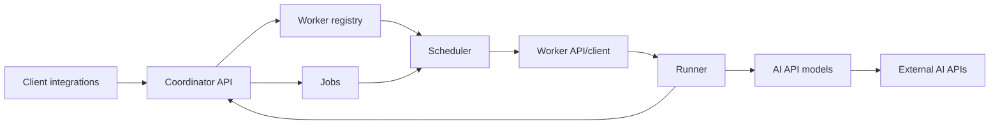

# TryOnService

TryOnService - сервис примерки на базе AI API. Проект проектируется как расширяемая Node.js + TypeScript система, где клиентские запросы попадают в coordinator, а тяжелую обработку выполняют независимые worker-серверы.

Главная идея архитектуры: coordinator отвечает за прием запросов, очередь, расписание и учет доступных worker'ов; worker при запуске сам регистрируется в coordinator через API и ключ доступа, после чего может получать задания и выполнять пайплайны обработки. Благодаря этому новые worker'ы можно добавлять горизонтально по мере роста нагрузки.

## Статус проекта

Сейчас реализован первый вертикальный срез на Node.js/TypeScript:

- coordinator принимает jobs, регистрирует worker'ы, получает heartbeat и назначает queued job доступному worker'у;
- worker при запуске регистрируется в coordinator, каждые 5 секунд отправляет heartbeat и обрабатывает назначенные jobs через mock AI model;
- Telegram client показывает команду `/request`, кнопку `Request`, создает job в coordinator и выводит пользователю ответ worker'а.

## Как устроен сервис



1. Клиент или интеграция отправляет запрос на примерку в coordinator.
2. Coordinator валидирует запрос, создает job и хранит состояние обработки.
3. Worker при запуске регистрируется в coordinator, передает свои возможности и регулярно подтверждает доступность.
4. Scheduler выбирает подходящий worker для job с учетом доступности, лимитов и возможностей.
5. Worker запускает runner, который готовит данные клиента, вызывает нужную реализацию AI API из `models` и возвращает результат/status в coordinator.

## Структура репозитория

- [apps](apps/README.md) - все приложения и общие пакеты монорепозитория.
- [apps/coordinator](apps/coordinator/README.md) - сервис-координатор: API, очередь jobs, registry worker'ов и scheduler.
- [apps/worker](apps/worker/README.md) - исполняющий сервис: регистрация в coordinator, запуск пайплайнов, вызовы AI API.
- [apps/shared](apps/shared/README.md) - общие контракты, DTO, типы и схемы валидации.
- [apps/client](apps/client/README.md) - клиентские интеграции, через которые пользователи создают задачи.
- `DemoPhotos/` - локальная игнорируемая папка для демонстрационных фотографий, не хранится в git.

## Основные зоны ответственности

Coordinator:

- принимает внешние запросы от клиентов и внутренних сервисов;
- хранит состояние jobs и историю переходов;
- ведет реестр worker'ов, их heartbeat, capacity и capabilities;
- назначает задания worker'ам и контролирует retries/timeouts.

Worker:

- при старте читает конфиг и регистрируется в coordinator по API key;
- сообщает о готовности, capacity и поддерживаемых моделях/пайплайнах;
- получает или принимает jobs, запускает runner и обновляет статус выполнения;
- изолирует конкретные AI API в `apps/worker/models`.

Shared:

- хранит типы запросов, ответов, статусов jobs и worker'ов;
- задает единый контракт между coordinator, worker и клиентами;
- должен изменяться первым, если меняется публичный формат данных.

## Локальный запуск

Установите зависимости:

```bash
npm install
```

Создайте локальный `.env` из примера и заполните токен Telegram-бота:

```powershell
Copy-Item .env.example .env
```

Запустите coordinator:

```bash
npm run dev:coordinator
```

В отдельном терминале запустите worker:

```bash
npm run dev:worker
```

В отдельном терминале запустите Telegram client:

```bash
npm run dev:telegram
```

По умолчанию используются адреса:

- coordinator: `http://localhost:3000`
- worker: `http://localhost:4001`
- telegram callback server: `http://localhost:4100`

Если worker, coordinator и Telegram client запускаются не на одной машине, задайте публичные URL через `COORDINATOR_PUBLIC_URL`, `WORKER_BASE_URL` и `TELEGRAM_CLIENT_PUBLIC_URL`.

## Проверка без Telegram

Можно проверить цепочку coordinator + worker обычным HTTP-запросом:

```bash
curl -X POST http://localhost:3000/jobs \
  -H "Content-Type: application/json" \
  -d "{\"client\":{\"type\":\"telegram\",\"chatId\":\"local-dev\"},\"payload\":{\"command\":\"request\"}}"
```

После обработки job в `GET http://localhost:3000/jobs` появится результат `Ответ от сервера.`.

## Сборка deploy-пакетов

Чтобы получить готовые папки для переноса на серверы, заполните локальный `.env` нужными адресами и выполните:

```bash
npm run build:dist
```

Результат появится в `dist/packages`:

- `dist/packages/coordinator` - готовый coordinator.
- `dist/packages/worker` - готовый worker.
- `dist/packages/telegram-client` - готовый Telegram client.

Каждый пакет содержит:

- `app/` - скомпилированный JavaScript;
- `.env` - настройки, сгенерированные из локального `.env`;
- `start.cmd` - запуск на Windows;
- `start.sh` - запуск на Linux/macOS;
- `package.json` - минимальный package-файл с `npm start`;
- `BUILD_INFO.txt` - commit и время сборки.

Для запуска deploy-пакета на сервере нужен Node.js `>=18`; выполнять `npm install` внутри пакета не нужно, потому что runtime-зависимости сейчас не используются.

`dist/packages/*/.env` содержит значения из локального `.env`, включая токены, поэтому `dist/` не хранится в git и должен передаваться только в нужное окружение.

Для production-сборки с отдельным набором адресов можно использовать другой env-файл:

```powershell
$env:BUILD_ENV_FILE=".env.production"
npm run build:dist
```

По умолчанию `BUILD_ENV_FILE=.env` указан в `.env.example`, поэтому обычная сборка берет настройки из локального `.env`.

Минимально важные адреса:

- `COORDINATOR_PUBLIC_URL` - публичный URL coordinator, который он передает worker'ам для callbacks.
- `COORDINATOR_URL` - адрес coordinator для worker и Telegram client.
- `WORKER_BASE_URL` - адрес worker, по которому coordinator отправляет jobs.
- `TELEGRAM_CLIENT_PUBLIC_URL` - адрес Telegram client callback server, по которому worker вернет ответ для пользователя.

## Расширение системы

- Новый AI provider добавляйте в [apps/worker/models](apps/worker/models/README.md).
- Новый сценарий обработки данных клиента добавляйте в [apps/worker/runner](apps/worker/runner/README.md).
- Новый endpoint coordinator добавляйте в [apps/coordinator/api](apps/coordinator/api/README.md).
- Новое состояние job или worker сначала описывайте в [apps/shared/contracts](apps/shared/contracts/README.md).
- Новую клиентскую интеграцию добавляйте в [apps/client](apps/client/README.md).

## Принципы разработки

- Contracts first: общие DTO и статусы должны жить в `apps/shared`.
- Worker'ы должны быть максимально stateless: локально допустимы только временные файлы обработки.
- Все внешние AI API должны быть закрыты адаптерами в `models`, чтобы runner не зависел от конкретного провайдера.
- Jobs должны быть идемпотентными там, где это возможно: повторная обработка не должна ломать состояние клиента.
- Секреты, API keys и токены не хранятся в git. Используйте `.env` или секрет-хранилище окружения.
