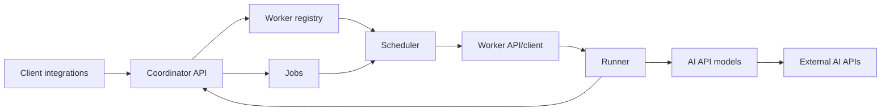

# TryOnService

TryOnService - сервис примерки на базе AI API. Проект проектируется как расширяемая Node.js + TypeScript система, где клиентские запросы попадают в coordinator, а тяжелую обработку выполняют независимые worker-серверы.

Главная идея архитектуры: coordinator отвечает за прием запросов, очередь, расписание и учет доступных worker'ов; worker при запуске сам регистрируется в coordinator через API и ключ доступа, после чего может получать задания и выполнять пайплайны обработки. Благодаря этому новые worker'ы можно добавлять горизонтально по мере роста нагрузки.

## Статус проекта

Сейчас в репозитории зафиксирован скелет будущего сервиса и документация по зонам ответственности. Реализация на Node.js/TypeScript будет добавляться поверх этой структуры.

## Как устроен сервис



1. Клиент или интеграция отправляет запрос на примерку в coordinator.
2. Coordinator валидирует запрос, создает job и хранит состояние обработки.
3. Worker при запуске регистрируется в coordinator, передает свои возможности и регулярно подтверждает доступность.
4. Scheduler выбирает подходящий worker для job с учетом доступности, лимитов и возможностей.
5. Worker запускает runner, который готовит данные клиента, вызывает нужную реализацию AI API из `models` и возвращает результат/status в coordinator.

## Структура репозитория

- [apps](apps/README.md) - все приложения и общие пакеты монорепозитория.
- [apps/coordinator](apps/coordinator/README.md) - сервис-координатор: API, очередь jobs, registry worker'ов и scheduler.
- [apps/worker](apps/worker/README.md) - исполняющий сервис: регистрация в coordinator, запуск пайплайнов, вызовы AI API.
- [apps/shared](apps/shared/README.md) - общие контракты, DTO, типы и схемы валидации.
- [apps/client](apps/client/README.md) - клиентские интеграции, через которые пользователи создают задачи.
- [DemoPhotos](DemoPhotos/README.md) - локальные демонстрационные фотографии для ручной проверки сценариев.

## Основные зоны ответственности

Coordinator:

- принимает внешние запросы от клиентов и внутренних сервисов;
- хранит состояние jobs и историю переходов;
- ведет реестр worker'ов, их heartbeat, capacity и capabilities;
- назначает задания worker'ам и контролирует retries/timeouts.

Worker:

- при старте читает конфиг и регистрируется в coordinator по API key;
- сообщает о готовности, capacity и поддерживаемых моделях/пайплайнах;
- получает или принимает jobs, запускает runner и обновляет статус выполнения;
- изолирует конкретные AI API в `apps/worker/models`.

Shared:

- хранит типы запросов, ответов, статусов jobs и worker'ов;
- задает единый контракт между coordinator, worker и клиентами;
- должен изменяться первым, если меняется публичный формат данных.

## Рекомендованный старт разработки

После добавления `package.json` и TypeScript-конфигурации ожидаемый базовый поток будет таким:

```bash
npm install
npm run dev:coordinator
npm run dev:worker
npm test
```

До появления этих команд ориентируйтесь на README внутри модулей и сохраняйте текущие границы ответственности.

## Расширение системы

- Новый AI provider добавляйте в [apps/worker/models](apps/worker/models/README.md).
- Новый сценарий обработки данных клиента добавляйте в [apps/worker/runner](apps/worker/runner/README.md).
- Новый endpoint coordinator добавляйте в [apps/coordinator/api](apps/coordinator/api/README.md).
- Новое состояние job или worker сначала описывайте в [apps/shared/contracts](apps/shared/contracts/README.md).
- Новую клиентскую интеграцию добавляйте в [apps/client](apps/client/README.md).

## Принципы разработки

- Contracts first: общие DTO и статусы должны жить в `apps/shared`.
- Worker'ы должны быть максимально stateless: локально допустимы только временные файлы обработки.
- Все внешние AI API должны быть закрыты адаптерами в `models`, чтобы runner не зависел от конкретного провайдера.
- Jobs должны быть идемпотентными там, где это возможно: повторная обработка не должна ломать состояние клиента.
- Секреты, API keys и токены не хранятся в git. Используйте `.env` или секрет-хранилище окружения.
