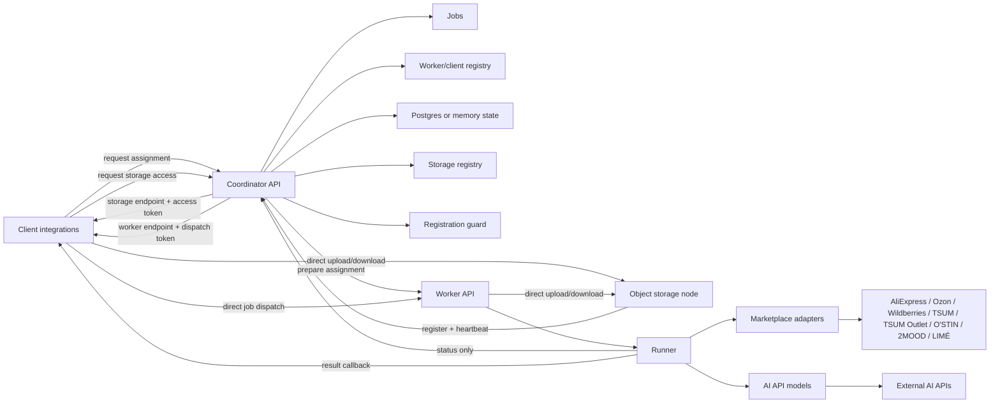

# TryOnService

TryOnService - сервис примерки на базе AI API. Проект проектируется как расширяемая Node.js + TypeScript система, где coordinator подбирает подходящий worker для клиента, а тяжелую обработку выполняют независимые worker-серверы.

Главная идея архитектуры: coordinator не должен становиться узким местом для клиентских результатов. Он ведет registry worker'ов и service clients, выбирает подходящий worker, заранее сообщает worker-у о будущем client connection для конкретной job, затем возвращает клиенту endpoint worker'а с подписанным dispatch token. После этого клиент отправляет heavy request worker'у напрямую, а worker отправляет результат напрямую в callback клиента.

## Статус проекта

Сейчас реализован первый вертикальный срез на Node.js/TypeScript:

- coordinator регистрирует worker'ы и service clients, получает heartbeat, ведет очередь jobs, выбирает worker по capacity/capabilities, готовит assignment на worker-е и возвращает клиенту выбранный worker;
- object storage node регистрируется в coordinator по отдельному ключу, отправляет heartbeat, принимает streaming upload/download от клиентов и worker'ов по короткоживущему signed storage token и ведет catalog index cache entries;
- worker при запуске подбирает свободный порт, регистрируется в coordinator, каждые 5 секунд отправляет heartbeat с учетом running jobs и pending assignments, принимает jobs напрямую от клиентов только после prepare от coordinator, выбирает AI provider из `payload.model.provider` конкретной job и при наличии `payload.market` подтягивает товары/фото из marketplace adapters с shared storage-cache;
- Telegram client подбирает свободный callback-порт, регистрируется в coordinator, по `/start` показывает меню `Анализ внешности` и `Идеальный образ`, умеет отменять сценарии, получает assignment или `queued`-ответ, polling-ом дожидается свободного worker'а, отправляет job worker'у напрямую и продолжает сценарий после callback; `Идеальный образ` получает товарные кандидаты через marketplace adapters Ozon/Wildberries/TSUM/TSUM Outlet/O'STIN/2MOOD/LIMÉ, затем отдает OpenAI только vision-проверку изображений и генерацию clean-card на белом фоне; длинные ответы режутся на несколько сообщений и Markdown отображается форматированно; фото с подписью `/request openai:gpt-5.6-luna` также отправляется на OpenAI/ChatGPT vision adapter с выбранной моделью из запроса;
- coordinator защищает регистрацию worker'ов, service clients и storage-node от перебора ключа: после достижения лимита неверных попыток IP блокируется; при `COORDINATOR_PERSISTENCE=postgres` ban сохраняется в БД и переживает restart;
- registration, service-to-service, dispatch token, client callback, storage access и admin/debug доступ используют разные ключи;
- clients, worker и storage-node регистрируются по общим registration keys для быстрого горизонтального масштабирования;
- signed tokens содержат `tokenId` и `keyVersion`: worker dispatch и client callback защищены от replay, а storage-access ограничивается TTL, storageId, scope и ownership prefix;
- coordinator пишет security audit events в memory/Postgres backend;
- HTTP API имеют лимиты размера JSON body, базовый rate limit и timeout/retry для исходящих service calls;
- coordinator умеет работать с `memory` или `postgres` persistence backend;
- для файлов и изображений добавлен object storage слой: в jobs/results передаются `StorageObjectRef`, а не бинарные данные; доступны `local` и S3-compatible storage drivers.

## Как устроен сервис



1. Client, worker и storage-node при запуске регистрируются в coordinator и регулярно подтверждают доступность.
2. Клиент запрашивает у coordinator storage-access, получает подходящий storage-node и короткоживущий token, затем загружает изображения напрямую в storage-node.
3. Клиент отправляет запрос на assignment в coordinator, передавая в payload выбранную модель (`payload.model`), `StorageObjectRef` со `storageId`, metadata и пользовательский контекст.
4. Coordinator валидирует запрос, находит callback URL клиента, создает queued job и пытается сразу выбрать доступный worker и storage-node.
5. Coordinator отправляет worker-у lightweight prepare-запрос: `jobId`, client/callback metadata, required capabilities, срок жизни dispatch token и signed callback token для ответа клиенту.
6. Если worker подтвердил prepare, coordinator возвращает клиенту assignment с worker endpoint, `workerRequest`, signed dispatch token и scoped storage-access для worker'а. Если свободного worker/storage нет, coordinator возвращает `202 queued`, а client polling-ом вызывает `GET /jobs/:id/assignment`.
7. Клиент отправляет heavy request напрямую на worker endpoint с `x-job-dispatch-token`.
8. Worker принимает job только если token валиден и assignment заранее подготовлен coordinator-ом, затем запускает runner и работает с файлами напрямую через storage-node.
9. Worker отправляет status-only update в coordinator и результат на callback клиента с `x-client-callback-token`. Если AI обработка завершилась, но callback клиенту не доставлен, job получает статус `delivery_failed`, сохраняя `result`.

## Данные, БД и файлы

Postgres принадлежит coordinator. Worker и client не получают `POSTGRES_URL` и не пишут в БД напрямую. Они меняют состояние только через API coordinator.

В Postgres хранятся:

- jobs и переходы статусов;
- registered workers и registered service clients;
- registered storage-node и heartbeat/capacity данные;
- ссылки на storage-объекты внутри payload/result jobs; инкрементальная metadata объектов и `usedBytes` ведутся самим storage-node.
- security audit events и persistent registration bans, если включен Postgres backend.

Файлы и изображения хранятся в отдельных object storage node. Есть dev backend `STORAGE_DRIVER=local`, который пишет файлы в `STORAGE_LOCAL_ROOT`, и S3-compatible backend `STORAGE_DRIVER=s3`. Storage-node сам получает стабильный id: если `STORAGE_ID` пустой, он генерирует id при первом запуске и сохраняет его в `STORAGE_ID_PATH` или `STORAGE_LOCAL_ROOT/.tryon-storage-id`. Storage-node ведет metadata index (`STORAGE_METADATA_PATH` или файл рядом с local root), поэтому `usedBytes` обновляется инкрементально при PUT/DELETE и heartbeat не обходит всю папку. Дополнительно storage-node ведет catalog index (`STORAGE_CATALOG_PATH` или файл рядом с root), где cache keys указывают на объекты, например clean product card по URL товара или JSON marketplace search. В jobs можно передавать `payload.inputFiles`, а worker result может вернуть `result.files`. Ref, который вернул storage-node, содержит `storageId`, чтобы coordinator выдал worker'у доступ к правильному узлу.

Coordinator не принимает и не отдает бинарные файлы. Он выдает `POST /storage/access`: клиент или worker получает `StorageAccessAssignment` с `objectBaseUrl`, scoped `accessToken`, TTL и, при необходимости, `keyPrefix`. Для новых записей coordinator выбирает свежий storage-node с учетом `usedBytes/capacityBytes`, а при равной загрузке распределяет запросы между подходящими узлами. После этого upload/download идет напрямую в storage-node через `PUT /objects/<key>` и `GET /objects/<key>`. Для внешних preview/download URL, например Telegram `sendPhoto`, worker может вернуть `StorageObjectRef.url` с тем же storage token в query `accessToken`.

Для distributed cache используется `POST /storage/catalog/lookup`: client/worker передает cacheKeys и kinds, coordinator опрашивает все свежие storage-node через `STORAGE_SERVICE_KEY` и возвращает все locations с read-token на конкретный object prefix. Так несколько storage-node могут хранить дополняющую информацию по одному товару: например один хранит `market-product`, другой - `product-card-image`.

Если job содержит несколько входных файлов, они должны лежать на одном storage-node и под общим prefix, например `clients/<clientId>/input/<requestId>/...`. Coordinator не выдает клиенту доступ за пределы `clients/<clientId>`; worker может получить доступ к `workers/<workerId>` или `jobs/<jobId>`/общему job prefix, который выдал coordinator.

## Структура репозитория

- [apps](apps/README.md) - все приложения и общие пакеты монорепозитория.
- [apps/coordinator](apps/coordinator/README.md) - сервис-координатор: API assignment, jobs state, registry worker'ов/service clients, assignment cleanup и coordinator utilities.
- [apps/storage](apps/storage/README.md) - object storage node: самостоятельная регистрация в coordinator, heartbeat и прямой upload/download файлов.
- [apps/worker](apps/worker/README.md) - исполняющий сервис: регистрация в coordinator, запуск пайплайнов, вызовы AI API и marketplace adapters.
- [apps/shared](apps/shared/README.md) - общие контракты, DTO, типы и runtime validators.
- [apps/client](apps/client/README.md) - клиентские интеграции, через которые пользователи создают задачи.
- `DemoPhotos/` - локальная игнорируемая папка для демонстрационных фотографий, не хранится в git.
- `devtest/` - генерируемая и игнорируемая папка для изолированного локального test runtime: compiled app, logs и local object storage.

## Основные зоны ответственности

Coordinator:

- принимает внешние запросы от клиентов и внутренних сервисов;
- хранит состояние jobs и историю переходов;
- ведет реестр worker'ов и service clients, их heartbeat, capacity и capabilities;
- подбирает worker, готовит pending assignment на worker-е и выдает клиенту signed assignment для прямой отправки job;
- ведет registry storage-node, выдает клиентам и worker'ам scoped storage-access token;
- проверяет ownership storage-prefix, чтобы client не мог запросить доступ к чужому `clients/<id>` namespace;
- чистит просроченные assignments, возвращает jobs в очередь и освобождает capacity worker'а только после подтвержденной отмены;
- пытается отменять pending/running job на worker-е, если assignment истек или service client пропал;
- блокирует IP, которые пытаются подобрать `WORKER_REGISTRATION_KEY`, `CLIENT_REGISTRATION_KEY` или `STORAGE_REGISTRATION_KEY`; в Postgres режиме ban сохраняется в `tryon_registration_bans`.

Object storage node:

- при старте выбирает свободный порт, получает стабильный storage id из файла или генерирует новый, регистрируется в coordinator по `STORAGE_REGISTRATION_KEY` и сообщает публичный endpoint;
- отправляет heartbeat coordinator-у по `STORAGE_SERVICE_KEY`;
- принимает `PUT /objects/<key>` и `GET /objects/<key>` только с signed token purpose `storage-access`;
- принимает `POST /catalog/entries` для регистрации cache entry на уже загруженный objectKey;
- отвечает coordinator-у на `POST /catalog/lookup`, если на узле есть нужный `cacheKey`;
- хранит файлы локально или в S3-compatible backend за единым `ObjectStorage` интерфейсом;
- пишет и читает объекты streaming-ом, без полной загрузки файла в память процесса;
- ведет metadata index и `usedBytes` инкрементально, без рекурсивного обхода storage на heartbeat.

Worker:

- при старте читает конфиг и регистрируется в coordinator по registration key и своему service key;
- сообщает о готовности, capacity и поддерживаемых моделях/пайплайнах;
- держит pending assignments, принимает jobs от клиентов по signed dispatch token, запускает runner и обновляет статус выполнения;
- выбирает adapter из `apps/worker/models` через `payload.model.provider`: доступны `mock`, `pruna`, `pixelcut`, `tryoncloud`, `genlook`, `wearfits`, `openai`;
- выбирает marketplace adapters через `payload.market.providers`: доступны `aliexpress`, `ozon`, `wildberries`, `tsum`, `tsum-outlet`, `ostin`, `2mood`, `lime`; Ozon/Wildberries/TSUM/TSUM Outlet/O'STIN/2MOOD/LIMÉ поддерживают public parsing без seller-token, найденные товары возвращаются в `TryOnJobResult.marketProducts`, а результаты поиска кешируются в storage catalog;
- объявляет provider-specific capabilities по доступным provider settings, чтобы coordinator не выдавал job на неподходящий worker;
- для virtual try-on provider-ов ожидает в `payload.inputFiles` фото пользователя и фото одежды/товара, индексы задаются `TRYON_PERSON_IMAGE_INDEX` и `TRYON_GARMENT_IMAGE_INDEX`; OpenAI adapter использует фото пользователя для анализа внешности и wardrobe-рекомендаций, принимает `providerModel`/`options` из job, поддерживает `webSearch`, `inputImageUrls`, `imageGeneration` и `toolChoice`, а generated files сохраняет в storage и возвращает в `result.files`;
- отправляет клиентский результат напрямую в callback URL из assignment;
- изолирует конкретные AI API в `apps/worker/models`.

Shared:

- хранит типы запросов, ответов, статусов jobs и worker'ов;
- задает единый контракт между coordinator, worker и клиентами;
- должен изменяться первым, если меняется публичный формат данных.

## Локальный запуск

Установите зависимости:

```bash
npm install
```

Создайте локальный `.env` из примера и заполните токен Telegram-бота:

```powershell
Copy-Item .env.example .env
```

Запустите coordinator:

```bash
npm run dev:coordinator
```

В отдельном терминале запустите object storage node:

```bash
npm run dev:storage
```

В отдельном терминале запустите worker:

```bash
npm run dev:worker
```

В отдельном терминале запустите Telegram client:

```bash
npm run dev:telegram
```

По умолчанию используются адреса:

- coordinator: `http://localhost:3000`
- object storage node: `http://localhost:4200`
- worker: `http://localhost:4001`
- telegram callback server: `http://localhost:4100`

Если основной порт storage-node, worker или Telegram client занят, сервис автоматически выберет ближайший свободный порт и зарегистрирует в coordinator фактический порт.

Если storage-node, worker, coordinator и Telegram client запускаются не на одной машине, задайте публичные URL через `COORDINATOR_PUBLIC_URL` и `COORDINATOR_URL`. Адреса storage-node, worker'а и Telegram client callback server coordinator определяет сам по IP registration-запроса и выбранному порту.

Если автоопределение публичного endpoint не подходит из-за NAT, reverse proxy или домена, задайте override через `STORAGE_PUBLIC_URL`, `WORKER_PUBLIC_URL` или `TELEGRAM_CLIENT_PUBLIC_URL`.

### Devtest одной командой

Для проверки всей локальной инфраструктуры без записи runtime-данных в исходники или `dist` используйте:

```bash
npm run devtest
```

Команда пересобирает TypeScript в `devtest/app`, создает `devtest/.env`, запускает coordinator, storage-node, worker и Telegram client из папки `devtest`, а логи пишет в `devtest/logs`. Local object storage в этом режиме находится в `devtest/runtime/storage/objects`, metadata index - в `devtest/runtime/storage/metadata.json`, catalog index - в `devtest/runtime/storage/catalog.json`, auto-id - в `devtest/runtime/storage/storage-id`. Для проверки нескольких storage-node задайте `DEVTEST_STORAGE_COUNT=2` или больше; дополнительные узлы получат отдельные `runtime/storage-2/...`, `runtime/storage-3/...`, свои id-файлы и будут выбираться coordinator-ом по загрузке.

Смотреть цепочку обработки job удобнее по логам:

```powershell
Get-Content D:\TryOnService\devtest\logs\telegram.log -Tail 120 -Wait
Get-Content D:\TryOnService\devtest\logs\coordinator.log -Tail 120 -Wait
Get-Content D:\TryOnService\devtest\logs\worker.log -Tail 160 -Wait
Get-Content D:\TryOnService\devtest\logs\storage.log -Tail 120 -Wait
```

`LOG_LEVEL=info` уже показывает lifecycle `upload -> assignment -> worker -> model -> callback`; для ещё более подробного режима задайте `LOG_LEVEL=debug`.

`devtest/.env` собирается из `.env.example` и файла `DEVTEST_ENV_FILE` (`.env` по умолчанию), но devtest принудительно использует `COORDINATOR_PERSISTENCE=memory`, `REQUIRE_HTTPS_ENDPOINTS=false` и локальные public URL. Если `TELEGRAM_BOT_TOKEN` не настроен и оставлен demo-placeholder, Telegram client будет пропущен; для строгой проверки задайте `DEVTEST_REQUIRE_TELEGRAM=true`.

Для сборки без запуска сервисов:

```bash
npm run build:devtest
```

Остановить все devtest-процессы можно через `Ctrl+C` в терминале, где запущен `npm run devtest`. Папка `devtest/` игнорируется git и может быть удалена в любой момент.

## Безопасность

Секреты разделены по зонам ответственности:

- `WORKER_REGISTRATION_KEY` - registration gate для worker'ов в `POST /workers/register`, передается как `x-worker-registration-key`.
- `WORKER_SERVICE_KEY` - общий service key для heartbeat, prepare, progress, result и cancel после регистрации; передается как `x-worker-service-key`.
- `WORKER_DISPATCH_SIGNING_KEY` - подпись dispatch token, который coordinator выдает клиенту для прямого `POST /jobs` на worker.
- `WORKER_DISPATCH_SIGNING_KEY_VERSION` - версия ключа подписи dispatch token; worker принимает только токены текущей версии.
- `CLIENT_REGISTRATION_KEY` - общий ключ для регистрации и heartbeat service clients, а также создания jobs в coordinator; передается как `x-client-key`.
- `CLIENT_CALLBACK_SIGNING_KEY` - подпись callback token, по которому Telegram client проверяет ответ worker'а.
- `CLIENT_CALLBACK_SIGNING_KEY_VERSION` - версия callback signing key; Telegram client отклоняет токены другой версии.
- `ADMIN_API_KEY` - доступ к debug/admin endpoints coordinator: `GET /health`, `GET /jobs`, `GET /jobs/:id`; передается как `x-admin-key`.
- `STORAGE_REGISTRATION_KEY` - registration gate для storage-node в `POST /storage/register`, передается как `x-storage-registration-key`.
- `STORAGE_SERVICE_KEY` - общий service key для heartbeat/health storage-node после регистрации; передается как `x-storage-service-key`.
- `STORAGE_ACCESS_SIGNING_KEY` - подпись scoped token, по которому client/worker ходят напрямую в storage-node.
- `STORAGE_ACCESS_SIGNING_KEY_VERSION` - версия storage-access signing key; storage-node принимает только токены текущей версии.

Клиент не может подставить произвольный `callbackUrl` при создании job. Coordinator всегда берет callback URL из registry по `sourceClientId`, поэтому `POST /jobs` требует зарегистрированный и ready service client.

Для worker, client и storage registration есть защита от перебора: если один direct remote IP достигнет лимита неверных ключей в `POST /workers/register`, `POST /clients/register` или `POST /storage/register`, coordinator вернет `403 ..._ip_banned`. В memory режиме ban живет до restart; в Postgres режиме ban хранится в `tryon_registration_bans` и загружается при старте coordinator.

Адрес для бана берется из прямого socket remote address, а не из `x-forwarded-for`, чтобы атакующий не мог легко менять IP заголовком. `x-forwarded-for` и `x-real-ip` используются только для автоопределения публичного endpoint storage-node/worker/client при регистрации.

`REQUIRE_HTTPS_ENDPOINTS=true` заставляет coordinator принимать регистрацию только с `https` public endpoint. Для mTLS используйте reverse proxy/private network перед Node.js процессами: приложения умеют работать по `https://` URL, а проверка клиентских сертификатов должна выполняться на edge/proxy уровне.

Все security-sensitive события (`invalid_*_registration_key`, `*_ip_banned`, `storage_prefix_forbidden`, `input_files_prefix_forbidden`, `job_queued`, `job_assignment_issued`, выдача storage-access) пишутся в audit store. В Postgres это таблица `tryon_security_events`; последние события доступны через admin endpoint `GET /security/events`.

## Проверка без Telegram Bot API

Можно проверить matchmaking coordinator + прямую отправку job worker'у через тестовый HTTP callback. Запустите coordinator, storage-node и worker, затем в отдельном терминале поднимите простой callback server:

```powershell
node -e "require('node:http').createServer((req,res)=>{let b='';req.on('data',c=>b+=c);req.on('end',()=>{console.log(req.method,req.url,req.headers['x-client-callback-token'],b);res.writeHead(200,{'content-type':'application/json'});res.end('{\"ok\":true}')})}).listen(4100,'0.0.0.0',()=>console.log('callback on 4100'))"
```

Зарегистрируйте тестовый service client, создайте assignment и отправьте job напрямую worker'у:

```powershell
$clientKey = "dev-client-registration-key"
$adminKey = "dev-admin-key"

curl.exe -s -X POST http://localhost:3000/clients/register `
  -H "Content-Type: application/json" `
  -H "x-client-key: $clientKey" `
  --data '{"clientId":"smoke-client","type":"telegram","port":4100,"publicUrl":"http://localhost:4100","callbackPath":"/callbacks/jobs"}'

$storage = curl.exe -s -X POST http://localhost:3000/storage/access `
  -H "Content-Type: application/json" `
  -H "x-client-key: $clientKey" `
  --data '{"requesterId":"smoke-client","requesterType":"client","scope":"read-write","keyPrefix":"clients/smoke-client/input"}' | ConvertFrom-Json

$uploadUrl = "$($storage.storage.objectBaseUrl)/clients/smoke-client/input/person.txt"
$uploaded = curl.exe -s -X PUT $uploadUrl `
  -H "x-storage-access-token: $($storage.storage.accessToken)" `
  -H "Content-Type: text/plain" `
  --data-binary "hello-storage" | ConvertFrom-Json

$assignment = curl.exe -s -X POST http://localhost:3000/jobs `
  -H "Content-Type: application/json" `
  -H "x-client-key: $clientKey" `
  --data (@{sourceClientId="smoke-client";client=@{type="telegram";chatId="local-dev"};payload=@{command="request";model=@{provider="mock";task="try-on"};inputFiles=@($uploaded.object)}} | ConvertTo-Json -Depth 10 -Compress) | ConvertFrom-Json

curl.exe -s -X POST $assignment.worker.jobUrl `
  -H "Content-Type: application/json" `
  -H "x-job-dispatch-token: $($assignment.worker.dispatchToken)" `
  --data ($assignment.workerRequest | ConvertTo-Json -Depth 10 -Compress)

curl.exe -s http://localhost:3000/jobs/$($assignment.job.id) `
  -H "x-admin-key: $adminKey"
```

После обработки job статус станет `succeeded`, а тестовый callback server напечатает тело callback и `x-client-callback-token`. Сам клиентский ответ не проходит через coordinator: worker отправляет его только в callback URL зарегистрированного клиента.

Если worker перестал отправлять heartbeat во время обработки, coordinator помечает его offline и переводит активные jobs этого worker'а в `failed`. Если service client перестал отправлять heartbeat, coordinator помечает client offline и пытается отменить pending/running job на worker-е. При подтвержденной отмене job становится `cancelled` и capacity освобождается; если отмена не подтверждена, coordinator не переоценивает capacity и ждет финальный результат worker-а.

## Сборка deploy-пакетов

Чтобы получить готовые папки для переноса на серверы, заполните локальный `.env` нужными адресами и выполните:

```bash
npm run build:dist
```

Результат появится в `dist/packages`:

- `dist/packages/coordinator` - готовый coordinator.
- `dist/packages/storage` - готовый object storage node.
- `dist/packages/worker` - готовый worker.
- `dist/packages/telegram-client` - готовый Telegram client.

Каждый пакет содержит:

- `app/` - скомпилированный JavaScript;
- `node_modules/` - runtime-зависимости, если они нужны пакету; сейчас включаются в coordinator package для Postgres-драйвера;
- `.env` - настройки, сгенерированные из локального `.env`;
- `start.cmd` - запуск на Windows;
- `start.sh` - запуск на Linux/macOS;
- `package.json` - минимальный package-файл с `npm start`;
- `BUILD_INFO.txt` - commit и время сборки.

Для запуска deploy-пакета на сервере нужен Node.js `>=18`; выполнять `npm install` внутри пакета не нужно.

`dist/packages/*/.env` содержит значения из локального `.env`, включая токены, поэтому `dist/` не хранится в git и должен передаваться только в нужное окружение.

Для production-сборки с отдельным набором адресов можно использовать другой env-файл:

```powershell
$env:BUILD_ENV_FILE=".env.production"
npm run build:dist
```

По умолчанию `BUILD_ENV_FILE=.env` указан в `.env.example`, поэтому обычная сборка берет настройки из локального `.env`.

Минимально важные адреса:

- `COORDINATOR_PUBLIC_URL` - публичный URL coordinator для status callbacks от worker'ов.
- `COORDINATOR_URL` - адрес coordinator для worker и Telegram client.
- `WORKER_REGISTRATION_KEY` - ключ регистрации worker'ов в coordinator.
- `WORKER_SERVICE_KEY` - общий ключ служебного общения coordinator <-> worker.
- `WORKER_DISPATCH_SIGNING_KEY`, `WORKER_DISPATCH_SIGNING_KEY_VERSION` - секрет и версия подписи dispatch token для прямого client -> worker запроса.
- `CLIENT_CALLBACK_SIGNING_KEY`, `CLIENT_CALLBACK_SIGNING_KEY_VERSION` - секрет и версия подписи callback token для worker -> client результата.
- `CLIENT_REGISTRATION_KEY` - общий ключ регистрации service clients в coordinator и создания jobs.
- `REQUIRE_HTTPS_ENDPOINTS` - запрет регистрации non-HTTPS public endpoints.
- `CLIENT_REGISTRATION_MAX_INVALID_ATTEMPTS` - сколько неверных client registration-ключей с одного IP допускается до бана; по умолчанию `5`.
- `ADMIN_API_KEY` - ключ доступа к debug/admin endpoints coordinator.
- `WORKER_REGISTRATION_MAX_INVALID_ATTEMPTS` - сколько неверных registration-ключей с одного IP допускается до бана; по умолчанию `5`.
- `STORAGE_REGISTRATION_KEY` - ключ регистрации storage-node в coordinator.
- `STORAGE_SERVICE_KEY` - общий ключ heartbeat/health для storage-node.
- `STORAGE_ACCESS_SIGNING_KEY`, `STORAGE_ACCESS_SIGNING_KEY_VERSION` - секрет и версия подписи storage-access token.
- `STORAGE_REGISTRATION_MAX_INVALID_ATTEMPTS` - сколько неверных storage registration-ключей с одного IP допускается до бана.
- `STORAGE_HEARTBEAT_INTERVAL_MS`, `STORAGE_HEARTBEAT_TIMEOUT_MS` - heartbeat storage-node и timeout исключения из активного пула.
- `STORAGE_ACCESS_TOKEN_TTL_MS` - срок жизни token для прямого upload/download в storage-node.
- `STORAGE_PORT` - порт storage-node; coordinator использует его вместе с IP registration-запроса.
- `STORAGE_ID` - опциональный ручной storage-node id; если пусто, storage-node создает и переиспользует auto-id на диске.
- `STORAGE_ID_PATH` - опциональный путь к файлу auto-id; если пусто, используется `STORAGE_LOCAL_ROOT/.tryon-storage-id`.
- `STORAGE_PUBLIC_PROTOCOL` - протокол публичного storage endpoint.
- `STORAGE_PUBLIC_URL` - опциональный ручной override для storage endpoint, если автоопределение по IP/port не подходит.
- `STORAGE_DRIVER` - `local` или `s3`.
- `STORAGE_LOCAL_ROOT` - локальная папка dev storage-node.
- `STORAGE_METADATA_PATH` - путь к metadata index storage-node; если пусто, выбирается рядом с storage root.
- `STORAGE_CATALOG_PATH` - путь к catalog index storage-node; если пусто, выбирается рядом с storage root.
- `STORAGE_S3_ENDPOINT`, `STORAGE_S3_REGION`, `STORAGE_S3_BUCKET`, `STORAGE_S3_ACCESS_KEY_ID`, `STORAGE_S3_SECRET_ACCESS_KEY`, `STORAGE_S3_FORCE_PATH_STYLE` - настройки S3-compatible backend.
- `STORAGE_CAPACITY_BYTES` - опциональная capacity storage-node; coordinator использует ее вместе с `usedBytes` для load-aware выбора storage.
- `STORAGE_MAX_OBJECT_BYTES` - максимальный размер одного объекта для прямого upload.
- `WORKER_PORT` - порт worker; coordinator использует его вместе с IP registration-запроса, чтобы отправлять jobs на worker.
- `WORKER_PUBLIC_PROTOCOL` - протокол публичного worker endpoint, обычно `http` или `https`.
- `WORKER_PUBLIC_URL` - опциональный ручной override для worker endpoint, если автоопределение по IP/port не подходит.
- `WORKER_DISPATCH_TOKEN_TTL_MS` - срок жизни signed token, по которому клиент может отправить конкретную job конкретному worker'у.
- `CLIENT_CALLBACK_TOKEN_TTL_MS` - срок жизни signed callback token для ответа worker -> client; должен покрывать максимальное время обработки.
- `JOB_ASSIGNMENT_TIMEOUT_MS` - сколько coordinator держит assignment в статусе `assigned`, если клиент не успел отправить job worker'у.
- `API_RATE_LIMIT_WINDOW_MS`, `API_RATE_LIMIT_MAX_REQUESTS` - базовый per-IP fixed-window лимит.
- `HTTP_CLIENT_TIMEOUT_MS`, `HTTP_CLIENT_RETRIES` - timeout и retry для исходящих HTTP-вызовов между сервисами.
- `MAX_JSON_BODY_BYTES` - лимит JSON body для входящих API-запросов.
- `COORDINATOR_PERSISTENCE` - `memory` для dev или `postgres` для persistent state coordinator.
- `POSTGRES_URL`, `POSTGRES_SSL`, `POSTGRES_MAX_CONNECTIONS` - настройки Postgres coordinator.
- `TELEGRAM_CLIENT_PUBLIC_PROTOCOL` - протокол публичного Telegram callback endpoint.
- `TELEGRAM_CLIENT_PUBLIC_URL` - опциональный ручной override для Telegram callback endpoint, если автоопределение по IP/port не подходит.

## Production readiness

Текущий срез подходит для локальной разработки и проверки архитектуры control-plane/data-plane. Перед production под растущую нагрузку нужны инфраструктурные слои:

- TLS на всех публичных endpoint и mTLS/private network на edge/proxy уровне; в приложениях включайте `REQUIRE_HTTPS_ENDPOINTS=true`.
- Persistent storage для jobs/registry: включается через `COORDINATOR_PERSISTENCE=postgres`.
- Distributed lease/lock механизм для нескольких coordinator-инстансов; текущая очередь и polling assignment рассчитаны на один активный coordinator.
- Production-grade object storage: S3-compatible backend уже есть, но для больших объемов нужно добавить multipart upload, lifecycle policy, bucket-level encryption и мониторинг ошибок backend-а.
- Централизованные metrics/logs/tracing и алерты по capacity, latency, failed jobs, stale worker/client; security events уже пишутся coordinator-ом, но их нужно вывести в SIEM/alerts.

## Расширение системы

- Новый AI provider добавляйте в [apps/worker/models](apps/worker/models/README.md).
- Новый marketplace provider добавляйте в [apps/worker/market](apps/worker/market/README.md).
- Инструкция по marketplace credentials/settings: [apps/worker/market/API_KEYS.md](apps/worker/market/API_KEYS.md).
- Новый сценарий обработки данных клиента добавляйте в [apps/worker/runner](apps/worker/runner/README.md).
- Новый endpoint coordinator добавляйте в [apps/coordinator/api](apps/coordinator/api/README.md).
- Новое состояние job или worker сначала описывайте в [apps/shared/contracts](apps/shared/contracts/README.md).
- Новую клиентскую интеграцию добавляйте в [apps/client](apps/client/README.md), подробный порядок для website, Discord и других клиентов описан в [apps/client/NEW_CLIENT_GUIDE.md](apps/client/NEW_CLIENT_GUIDE.md).

## Принципы разработки

- Contracts first: общие DTO и статусы должны жить в `apps/shared`.
- Worker'ы должны быть максимально stateless: локально допустимы только временные файлы обработки.
- Все внешние AI API должны быть закрыты адаптерами в `models`, чтобы runner не зависел от конкретного провайдера.
- Все внешние marketplace API/parsers должны быть закрыты адаптерами в `market`, чтобы runner работал с единым `MarketProductRef`.
- Jobs должны быть идемпотентными там, где это возможно: повторная обработка не должна ломать состояние клиента.
- Секреты, API keys и токены не хранятся в git. Используйте `.env` или секрет-хранилище окружения.
