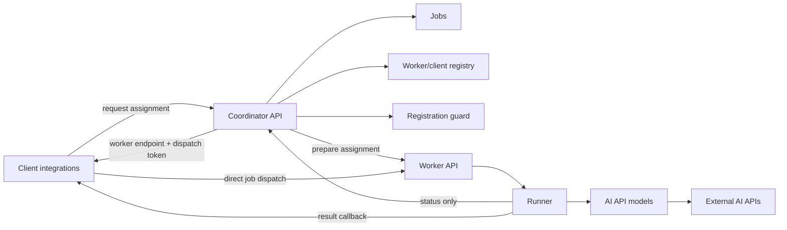

# TryOnService

TryOnService - сервис примерки на базе AI API. Проект проектируется как расширяемая Node.js + TypeScript система, где coordinator подбирает подходящий worker для клиента, а тяжелую обработку выполняют независимые worker-серверы.

Главная идея архитектуры: coordinator не должен становиться узким местом для клиентских результатов. Он ведет registry worker'ов и service clients, выбирает подходящий worker, заранее сообщает worker-у о будущем client connection для конкретной job, затем возвращает клиенту endpoint worker'а с подписанным dispatch token. После этого клиент отправляет heavy request worker'у напрямую, а worker отправляет результат напрямую в callback клиента.

## Статус проекта

Сейчас реализован первый вертикальный срез на Node.js/TypeScript:

- coordinator регистрирует worker'ы и service clients, получает heartbeat, выбирает worker по capacity/capabilities, готовит assignment на worker-е и возвращает клиенту выбранный worker;
- worker при запуске подбирает свободный порт, регистрируется в coordinator, каждые 5 секунд отправляет heartbeat с учетом running jobs и pending assignments, принимает jobs напрямую от клиентов только после prepare от coordinator;
- Telegram client подбирает свободный callback-порт, регистрируется в coordinator, показывает команду `/request`, кнопку `Request`, получает assignment, отправляет job worker'у напрямую и выводит пользователю ответ worker'а.
- coordinator защищает регистрацию worker'ов от перебора ключа: после превышения лимита неверных попыток IP блокируется до перезапуска coordinator;
- registration, service-to-service, dispatch token, client callback и admin/debug доступ используют разные ключи;
- HTTP API имеют лимиты размера JSON body, базовый rate limit и timeout/retry для исходящих service calls.

## Как устроен сервис



1. Client и worker при запуске регистрируются в coordinator и регулярно подтверждают доступность.
2. Клиент отправляет запрос на assignment в coordinator.
3. Coordinator валидирует запрос, находит callback URL клиента, выбирает доступный worker, резервирует capacity и создает job.
4. Coordinator отправляет worker-у lightweight prepare-запрос: `jobId`, client/callback metadata, required capabilities, срок жизни dispatch token и signed callback token для ответа клиенту.
5. Если worker подтвердил prepare, coordinator возвращает клиенту assignment с worker endpoint, `workerRequest` и signed dispatch token.
6. Клиент отправляет heavy request напрямую на worker endpoint с `x-job-dispatch-token`.
7. Worker принимает job только если token валиден и assignment заранее подготовлен coordinator-ом, затем запускает runner.
8. Worker отправляет status-only update в coordinator и результат на callback клиента с `x-client-callback-token`.

## Структура репозитория

- [apps](apps/README.md) - все приложения и общие пакеты монорепозитория.
- [apps/coordinator](apps/coordinator/README.md) - сервис-координатор: API assignment, jobs state, registry worker'ов/service clients, assignment cleanup и coordinator utilities.
- [apps/worker](apps/worker/README.md) - исполняющий сервис: регистрация в coordinator, запуск пайплайнов, вызовы AI API.
- [apps/shared](apps/shared/README.md) - общие контракты, DTO, типы и схемы валидации.
- [apps/client](apps/client/README.md) - клиентские интеграции, через которые пользователи создают задачи.
- `DemoPhotos/` - локальная игнорируемая папка для демонстрационных фотографий, не хранится в git.

## Основные зоны ответственности

Coordinator:

- принимает внешние запросы от клиентов и внутренних сервисов;
- хранит состояние jobs и историю переходов;
- ведет реестр worker'ов и service clients, их heartbeat, capacity и capabilities;
- подбирает worker, готовит pending assignment на worker-е и выдает клиенту signed assignment для прямой отправки job;
- чистит просроченные assignments и освобождает capacity worker'а;
- пытается отменять pending assignment на worker-е, если assignment истек или service client пропал;
- блокирует IP, которые пытаются подобрать `WORKER_REGISTRATION_KEY` через регистрацию worker'а.

Worker:

- при старте читает конфиг и регистрируется в coordinator по API key;
- сообщает о готовности, capacity и поддерживаемых моделях/пайплайнах;
- держит pending assignments, принимает jobs от клиентов по signed dispatch token, запускает runner и обновляет статус выполнения;
- отправляет клиентский результат напрямую в callback URL из assignment;
- изолирует конкретные AI API в `apps/worker/models`.

Shared:

- хранит типы запросов, ответов, статусов jobs и worker'ов;
- задает единый контракт между coordinator, worker и клиентами;
- должен изменяться первым, если меняется публичный формат данных.

## Локальный запуск

Установите зависимости:

```bash
npm install
```

Создайте локальный `.env` из примера и заполните токен Telegram-бота:

```powershell
Copy-Item .env.example .env
```

Запустите coordinator:

```bash
npm run dev:coordinator
```

В отдельном терминале запустите worker:

```bash
npm run dev:worker
```

В отдельном терминале запустите Telegram client:

```bash
npm run dev:telegram
```

По умолчанию используются адреса:

- coordinator: `http://localhost:3000`
- worker: `http://localhost:4001`
- telegram callback server: `http://localhost:4100`

Если основной порт worker или Telegram client занят, сервис автоматически выберет ближайший свободный порт и зарегистрирует в coordinator фактический порт.

Если worker, coordinator и Telegram client запускаются не на одной машине, задайте публичные URL через `COORDINATOR_PUBLIC_URL` и `COORDINATOR_URL`. Адреса worker'а и Telegram client callback server coordinator определяет сам по IP registration-запроса и выбранному порту.

Если автоопределение публичного endpoint не подходит из-за NAT, reverse proxy или домена, задайте override через `WORKER_PUBLIC_URL` или `TELEGRAM_CLIENT_PUBLIC_URL`.

## Безопасность

Секреты разделены по зонам ответственности:

- `WORKER_REGISTRATION_KEY` - только регистрация worker'ов в `POST /workers/register`, передается как `x-worker-registration-key`.
- `WORKER_SERVICE_KEY` - служебные вызовы coordinator <-> worker: heartbeat, prepare, progress, result, cancel; передается как `x-worker-service-key`.
- `WORKER_DISPATCH_SIGNING_KEY` - подпись dispatch token, который coordinator выдает клиенту для прямого `POST /jobs` на worker.
- `CLIENT_REGISTRATION_KEY` - регистрация и heartbeat service clients, а также создание jobs в coordinator; передается как `x-client-key`.
- `CLIENT_CALLBACK_SIGNING_KEY` - подпись callback token, по которому Telegram client проверяет ответ worker'а.
- `ADMIN_API_KEY` - доступ к debug/admin endpoints coordinator: `GET /health`, `GET /jobs`, `GET /jobs/:id`; передается как `x-admin-key`.

Клиент не может подставить произвольный `callbackUrl` при создании job. Coordinator всегда берет callback URL из registry по `sourceClientId`, поэтому `POST /jobs` требует зарегистрированный и ready service client.

Для worker registration есть in-memory защита от перебора: если один direct remote IP отправит больше `WORKER_REGISTRATION_MAX_INVALID_ATTEMPTS` неверных ключей в `POST /workers/register`, coordinator вернет `403 worker_registration_ip_banned` и будет держать этот IP в бане до перезапуска процесса.

Адрес для бана берется из прямого socket remote address, а не из `x-forwarded-for`, чтобы атакующий не мог легко менять IP заголовком. `x-forwarded-for` и `x-real-ip` используются только для автоопределения публичного endpoint worker/client при регистрации.

## Проверка без Telegram Bot API

Можно проверить matchmaking coordinator + прямую отправку job worker'у через тестовый HTTP callback. Запустите coordinator и worker, затем в отдельном терминале поднимите простой callback server:

```powershell
node -e "require('node:http').createServer((req,res)=>{let b='';req.on('data',c=>b+=c);req.on('end',()=>{console.log(req.method,req.url,req.headers['x-client-callback-token'],b);res.writeHead(200,{'content-type':'application/json'});res.end('{\"ok\":true}')})}).listen(4100,'0.0.0.0',()=>console.log('callback on 4100'))"
```

Зарегистрируйте тестовый service client, создайте assignment и отправьте job напрямую worker'у:

```powershell
$clientKey = "dev-client-registration-key"
$adminKey = "dev-admin-key"

curl.exe -s -X POST http://localhost:3000/clients/register `
  -H "Content-Type: application/json" `
  -H "x-client-key: $clientKey" `
  --data '{"clientId":"smoke-client","type":"telegram","port":4100,"publicUrl":"http://localhost:4100","callbackPath":"/callbacks/jobs"}'

$assignment = curl.exe -s -X POST http://localhost:3000/jobs `
  -H "Content-Type: application/json" `
  -H "x-client-key: $clientKey" `
  --data '{"sourceClientId":"smoke-client","client":{"type":"telegram","chatId":"local-dev"},"payload":{"command":"request"}}' | ConvertFrom-Json

curl.exe -s -X POST $assignment.worker.jobUrl `
  -H "Content-Type: application/json" `
  -H "x-job-dispatch-token: $($assignment.worker.dispatchToken)" `
  --data ($assignment.workerRequest | ConvertTo-Json -Depth 10 -Compress)

curl.exe -s http://localhost:3000/jobs/$($assignment.job.id) `
  -H "x-admin-key: $adminKey"
```

После обработки job статус станет `succeeded`, а тестовый callback server напечатает тело callback и `x-client-callback-token`. Сам клиентский ответ не проходит через coordinator: worker отправляет его только в callback URL зарегистрированного клиента.

Если worker перестал отправлять heartbeat во время обработки, coordinator помечает его offline и переводит активные jobs этого worker'а в `failed`. Если service client перестал отправлять heartbeat, coordinator помечает client offline, освобождает зарезервированные worker slots и переводит активные jobs этого client в `failed`.

## Сборка deploy-пакетов

Чтобы получить готовые папки для переноса на серверы, заполните локальный `.env` нужными адресами и выполните:

```bash
npm run build:dist
```

Результат появится в `dist/packages`:

- `dist/packages/coordinator` - готовый coordinator.
- `dist/packages/worker` - готовый worker.
- `dist/packages/telegram-client` - готовый Telegram client.

Каждый пакет содержит:

- `app/` - скомпилированный JavaScript;
- `.env` - настройки, сгенерированные из локального `.env`;
- `start.cmd` - запуск на Windows;
- `start.sh` - запуск на Linux/macOS;
- `package.json` - минимальный package-файл с `npm start`;
- `BUILD_INFO.txt` - commit и время сборки.

Для запуска deploy-пакета на сервере нужен Node.js `>=18`; выполнять `npm install` внутри пакета не нужно, потому что runtime-зависимости сейчас не используются.

`dist/packages/*/.env` содержит значения из локального `.env`, включая токены, поэтому `dist/` не хранится в git и должен передаваться только в нужное окружение.

Для production-сборки с отдельным набором адресов можно использовать другой env-файл:

```powershell
$env:BUILD_ENV_FILE=".env.production"
npm run build:dist
```

По умолчанию `BUILD_ENV_FILE=.env` указан в `.env.example`, поэтому обычная сборка берет настройки из локального `.env`.

Минимально важные адреса:

- `COORDINATOR_PUBLIC_URL` - публичный URL coordinator для status callbacks от worker'ов.
- `COORDINATOR_URL` - адрес coordinator для worker и Telegram client.
- `WORKER_REGISTRATION_KEY` - ключ регистрации worker'ов в coordinator.
- `WORKER_SERVICE_KEY` - ключ служебного общения coordinator <-> worker.
- `WORKER_DISPATCH_SIGNING_KEY` - секрет подписи dispatch token для прямого client -> worker запроса.
- `CLIENT_CALLBACK_SIGNING_KEY` - секрет подписи callback token для worker -> client результата.
- `CLIENT_REGISTRATION_KEY` - ключ регистрации service clients в coordinator и создания jobs.
- `ADMIN_API_KEY` - ключ доступа к debug/admin endpoints coordinator.
- `WORKER_REGISTRATION_MAX_INVALID_ATTEMPTS` - сколько неверных registration-ключей с одного IP допускается до бана; по умолчанию `5`.
- `WORKER_PORT` - порт worker; coordinator использует его вместе с IP registration-запроса, чтобы отправлять jobs на worker.
- `WORKER_PUBLIC_PROTOCOL` - протокол публичного worker endpoint, обычно `http` или `https`.
- `WORKER_PUBLIC_URL` - опциональный ручной override для worker endpoint, если автоопределение по IP/port не подходит.
- `WORKER_DISPATCH_TOKEN_TTL_MS` - срок жизни signed token, по которому клиент может отправить конкретную job конкретному worker'у.
- `CLIENT_CALLBACK_TOKEN_TTL_MS` - срок жизни signed callback token для ответа worker -> client; должен покрывать максимальное время обработки.
- `JOB_ASSIGNMENT_TIMEOUT_MS` - сколько coordinator держит assignment в статусе `assigned`, если клиент не успел отправить job worker'у.
- `API_RATE_LIMIT_WINDOW_MS`, `API_RATE_LIMIT_MAX_REQUESTS` - базовый per-IP fixed-window лимит.
- `HTTP_CLIENT_TIMEOUT_MS`, `HTTP_CLIENT_RETRIES` - timeout и retry для исходящих HTTP-вызовов между сервисами.
- `MAX_JSON_BODY_BYTES` - лимит JSON body для входящих API-запросов.
- `TELEGRAM_CLIENT_PUBLIC_PROTOCOL` - протокол публичного Telegram callback endpoint.
- `TELEGRAM_CLIENT_PUBLIC_URL` - опциональный ручной override для Telegram callback endpoint, если автоопределение по IP/port не подходит.

## Production readiness

Текущий срез подходит для локальной разработки и проверки архитектуры control-plane/data-plane. Перед production под растущую нагрузку нужны инфраструктурные слои:

- TLS на всех публичных endpoint, желательно mTLS или private network для coordinator <-> worker.
- Persistent storage для jobs/registry вместо in-memory state, иначе рестарт coordinator теряет состояние.
- Очередь/lease-механизм для повторного назначения jobs и распределенных coordinator-инстансов.
- Object storage для изображений и больших payload'ов: через coordinator и JSON body должны идти metadata и ссылки, а не бинарные данные.
- Централизованные metrics/logs/tracing и алерты по capacity, latency, failed jobs, stale worker/client.

## Расширение системы

- Новый AI provider добавляйте в [apps/worker/models](apps/worker/models/README.md).
- Новый сценарий обработки данных клиента добавляйте в [apps/worker/runner](apps/worker/runner/README.md).
- Новый endpoint coordinator добавляйте в [apps/coordinator/api](apps/coordinator/api/README.md).
- Новое состояние job или worker сначала описывайте в [apps/shared/contracts](apps/shared/contracts/README.md).
- Новую клиентскую интеграцию добавляйте в [apps/client](apps/client/README.md).

## Принципы разработки

- Contracts first: общие DTO и статусы должны жить в `apps/shared`.
- Worker'ы должны быть максимально stateless: локально допустимы только временные файлы обработки.
- Все внешние AI API должны быть закрыты адаптерами в `models`, чтобы runner не зависел от конкретного провайдера.
- Jobs должны быть идемпотентными там, где это возможно: повторная обработка не должна ломать состояние клиента.
- Секреты, API keys и токены не хранятся в git. Используйте `.env` или секрет-хранилище окружения.
